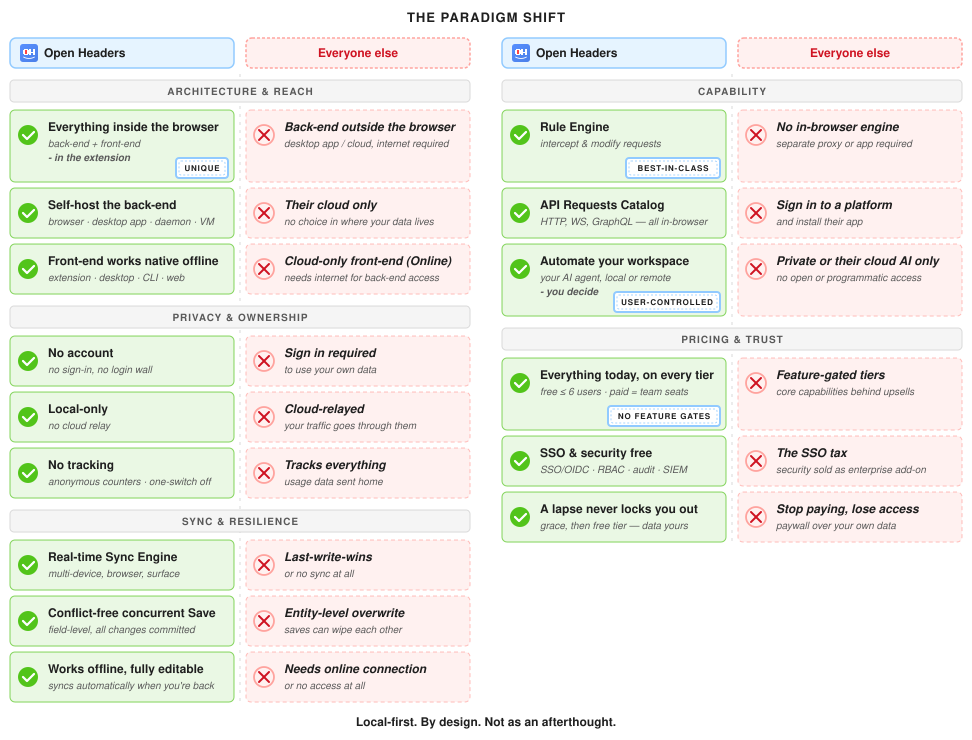

# Open Headers

Your existing Web DevToolkit inside a browser extension — Modify live
browser requests. Manage API Collections. Team Collaboration.

Local-first: no account, no cloud, your data stays on your machine.

**Website**: [openheaders.io](https://openheaders.io)

[](https://github.com/OpenHeaders/open-headers/releases/latest)

<picture>
  <source media="(prefers-color-scheme: dark)" srcset="./assets/paradigm-shift-dark.svg">
  
</picture>

## Downloads

- **Desktop app** — grab the installer for macOS, Windows, or Linux from
  the [Releases](https://github.com/OpenHeaders/open-headers/releases)
  page. The app checks for updates through
  `updates.openheaders.io` and notifies you; it never installs anything
  on its own.
- **Browser extension** — install from your browser's store:
  [Chrome](https://chromewebstore.google.com/detail/ablaikadpbfblkmhpmbbnbbfjoibeejb),
  [Firefox](https://addons.mozilla.org/en-US/firefox/addon/open-headers/), or
  [Edge](https://microsoftedge.microsoft.com/addons/detail/open-headers/gnbibobkkddlflknjkgcmokdlpddegpo).
  Every release also ships the extension zips for all browsers for
  air-gapped or managed environments (load unpacked).
- **CLI & daemon** — standalone `oh` / `ohd` binaries on every release
  page, or:

  ```sh
  curl -fsSL https://updates.openheaders.io/install.sh | sh
  ```

  Windows (PowerShell):

  ```powershell
  irm https://updates.openheaders.io/install.ps1 | iex
  ```

## Verify your download

Every release includes a `SHA256SUMS.txt` covering all assets. After
downloading, compare checksums:

macOS / Linux:

```sh
shasum -a 256 -c SHA256SUMS.txt --ignore-missing
```

Windows (PowerShell):

```powershell
(Get-FileHash .\OpenHeaders-Setup.exe).Hash
# compare against the matching line in SHA256SUMS.txt
```

If a checksum doesn't match, delete the file and re-download from the
[Releases](https://github.com/OpenHeaders/open-headers/releases) page —
and let us know at security@openheaders.io.

## Support & feedback

Questions, bug reports, and feature requests are welcome in this
repository's [issue tracker](https://github.com/OpenHeaders/open-headers/issues).

## Security

See [SECURITY.md](./SECURITY.md) for the vulnerability disclosure policy
and its safe harbor for good-faith research. Security contact:
security@openheaders.io.

## Licensing & privacy

Open Headers is proprietary software that is free to use. Every feature
in the product today is included in the free tier — paid plans exist
only to add team seats.

The software is local-first and account-free. The only usage data is
anonymous feature counting over a typed event allowlist — inspectable
in-app, byte for byte, and off with one switch.

- [End User License Agreement](https://openheaders.io/eula)
- [Privacy Policy](https://openheaders.io/privacy)
- [Security whitepaper](https://openheaders.io/security)
- [Wire transparency](https://openheaders.io/wire-transparency) — every
  network call the software can make, documented byte-for-byte
